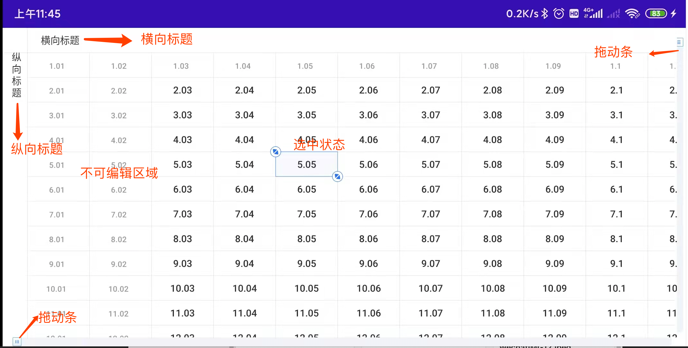
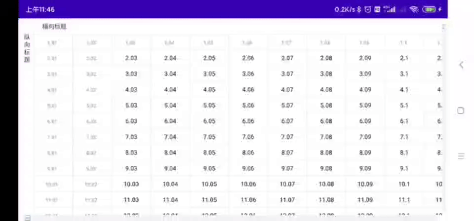
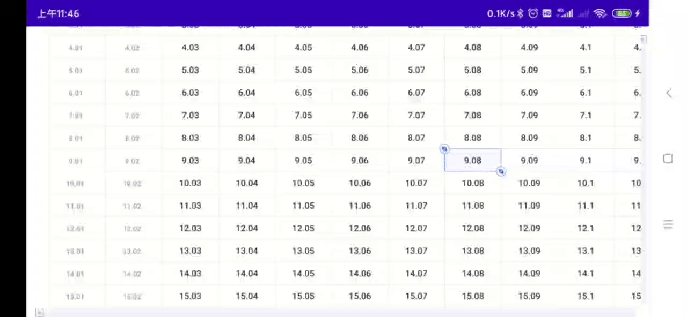
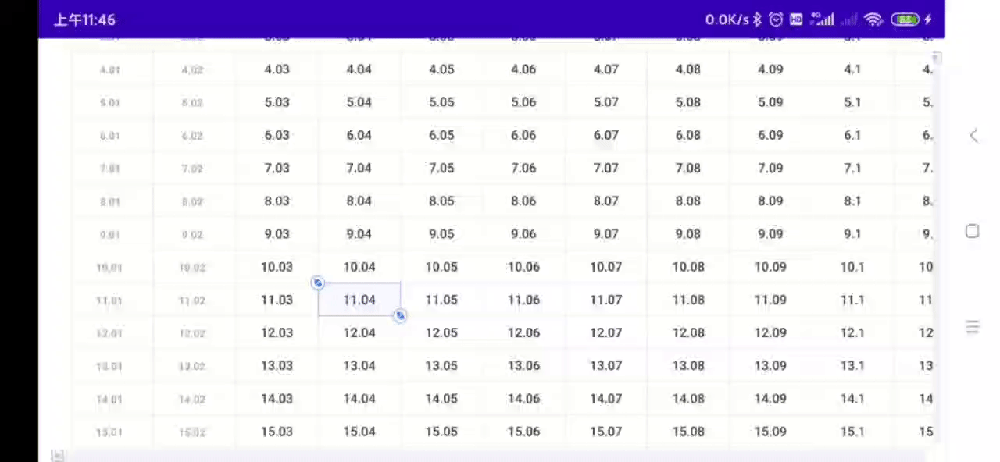
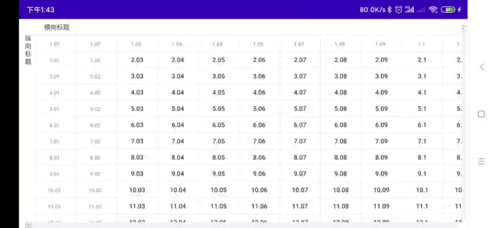

# ExcelView

## 项目介绍
项目是仿照WPS中Excel的功能实现的，实现了显示，滑动，编辑等基本功能，并且结构简单，可扩展性强，绘制性能较高。
当然，距离真正的商用还差有一定的差距，比如导出，公式计算，自动扩展等等都还未实现，希望后续使用的人能够一起参与进来，逐渐的进行完善和扩展。

## 效果简介

## 核心元素介绍
采用组合的设计模式，主要对象有以下几个，
* ExcelView：负责数据以及各种状态的渲染。
* ExcelEditDialog：选中某个cell后弹出复制，粘贴，加减乘除等选择框。
* KeyBoardDialog：负责对选中数据的编辑操作。
* ExcelControl：逻辑处理器。负责以上三个对象之间的关系关联。后续的导出xls功能，也通过由其负责串联。
* CommonSeekBar,CommonVerticalSeekBar：横向纵向的滚动条。

## 使用介绍
* 1.依赖ExcelViewLib库。
* 2.简单使用方式参照app中的fragment1和fragment2。
* 3.可扩展性：可通过继承ControlImpl重写其方法实现不同的业务场景逻辑。
* 4.可扩展性：可自定义Dialog，通过ControlImpl于ExcelView组合实现自定义样式。

## 实现逻辑介绍
WPS中excel实现了相当多的功能，不可能完全都实现，所以本项目聚焦于其核心功能实现即可。
核心功能总结下来就是读，写，存这三点，围绕这三点，我们整理下我们要实现的需求点：
* 1.在一屏幕的范围内显示几十甚至上百个Cell，并且不能卡顿。
* 2.一屏显示不下时，可以横向，纵向，斜向拖动表格，并且滑动流畅。
* 3.横向，纵向标题的实现。
* 4.可以进行单元格的选中。
* 5.可以通过拖动的方式实现批量的选择。
* 6.不可编辑区域的实现。
* 7.可以针对选中的单元格进行数据上的修改操作。
* 8.显示弹出框，支持对数据进行修。
* 9.修改的数据进行变色显示。
* 10.横向，纵向标题的实现。
* 11.编辑好的数据，可以导出到xls文件当中。（暂未实现）

围绕这11个需求点，我们挨个去讨论下如何去实现。
* **1.在一屏幕的范围内显示几十甚至上百个Cell，并且不能卡顿。**
  
大批量的显示数据，第一个想到的肯定是RecyclerView搭配GridLayout，但是实际上简单试了下，由于RecyclerView的原理仍然是每个Cell都需要单独创建，所以效率是很低的，采用RecyclerView的
  方案会导致首次进入相当的卡顿，所以这个方案弃用。想要高效率的绘制，我们首先要了解下整个View的渲染流程，这里就不详细展开了，我们实现的核心就是用一个View去实现所有的功能，抛出掉measure和layout   方法，只重写draw方法。因为View的数量多少对draw方法影响是很小的。所以最终决定采用Canvas自绘的方式，所以的内容，分割线的位置都一次性计算好，然后通过canvas进行绘制。
  

* **2.一屏显示不下时，可以横向，纵向，斜向拖动表格，并且滑动流畅。**
  
假设我们横向有10个cell，但是横向一屏只能显示5个cell，那我们想显示4到9的cell时怎么办呢？这里我想了一个简单的实现方案，还是按照10个去计算，显示4到9的时候，只要每个cell的x值都减去4个cell的 宽度即可。这样第0到4个cell，会因为x轴计算为负数而被挤出屏幕，也就不会在屏幕内显示了。高度的实现原理也是一样的。
  
滑动自然采用的是重写dispatchTouchEvent方法计算横向纵向偏移的方式。

* **3.横向，纵向标题的实现。**
  
横向标题和纵向标题，这个需要逻辑特殊处理下。横向标题的话，一样计算一个偏移量，然后每个cell的Y坐标都在基础之上增加这个偏移量。纵向原理类似。

* **4.可以进行单元格的选中。**
  
单元格选中是下面这种样式的，实现不难，因为单元格是挨个计算的，所以计算到这个单元格的时候，额外添加样式即可。

  
但是因为绘制选中单元格肯定会影响四周的单元格，所以我这里进行了两遍绘制，先绘制所有单元格，然后再去绘制选中单元格，选中单元格的样式是直接覆盖上去的。

* **5.可以通过拖动的方式实现批量的选择。**
  
拖动选择和拖动表格都用到了手势监听，所以肯定会有冲突。我这里的解决方案就是看是否先选中，如果选中了某个cell则认为是拖动选择，否则认为是拖动表格。

* **6.不可编辑区域的实现。**
  
手势滑动，滑动结束后计算坐标，如果在不可编辑区域，则把选中的范围做适当的修改。

* **7.可以针对选中的单元格进行数据上的修改操作。**
  
个人很欣赏RcyclerView的组合模式，所以这里我也使用了组合的设计模式。ExcelView本身只注重数据的渲染和选择，修改，变色等等所有的逻辑都交给外部类来控制。

* **8.显示弹出框，支持对数据进行修改。**
  
组合模式分为三块，弹出框Dialog， ExcelView，组合器Control。编辑的弹出框并不直接和ExcelView绑定，而是通过Control来实现一个双向的绑定。

  
这样ExcelView可以适配不同的Dialog，同样的Dialog也可以适配不同的ExcelView。

* **9.修改的数据进行变色显示。**
  
ExcelView提供一个功能，设置范围的颜色，由外部来调用。这样不仅仅修改后可以进行变色，用户完全可以根据特定场景，根据自己的选择来使用。

* **0.横向纵向拖动条的显示。**
  
这个实现难点在于纵向的滑动条。借鉴网上的方案进行了实现。也放到项目里面供选择使用。

* **11.编辑好的数据，可以导出到xls文件当中。**
  
还未实现，目前是打算使用poi的方式进行导出。

